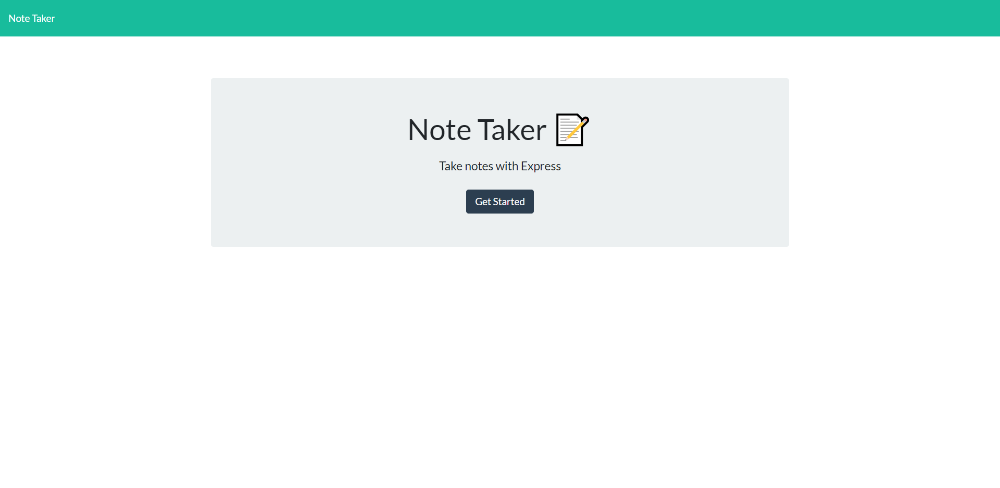
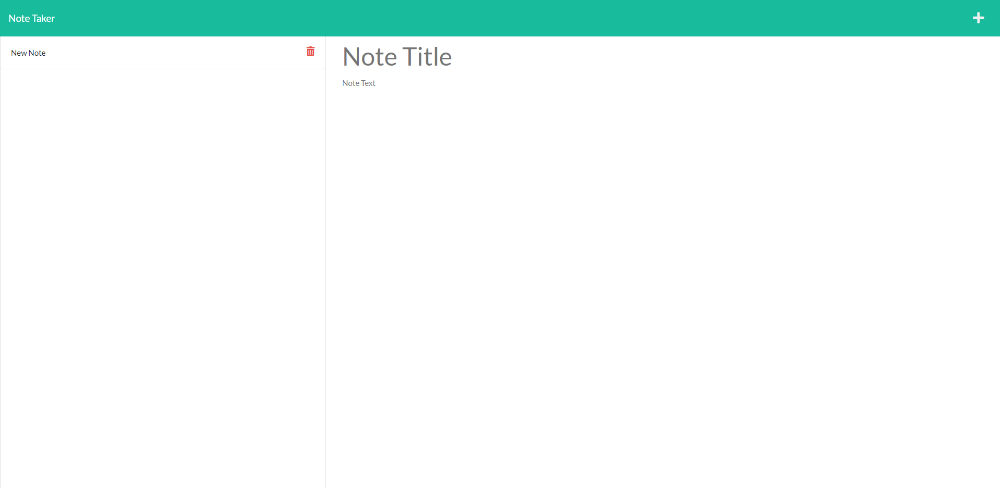

# note_taker
## Description
This project demonstrated my first forray into backend development. My goal was to make a server capable to listening for requests and provide different responses based on the routes of the requests. In the end, I was able to utilize node.js in conjunction with express to set up a basic server and database to track and return note objects.
## Table of Contents
- [Installation](#installation)
- [Usage](#usage)
- [Credits](#credits)
- [License](#license)
## Installation
Deployed Link: https://sheltered-scrubland-86582.herokuapp.com/
## Usage
Screenshots:

## Credits
https://github.com/Randy-chou
## License

## Features
Click the get started button on the home page to be taken to the note taker page. There you can press the plus button to edit a new note and then the save button to save it to the server database. You can also click on old saved note entries to look at or delete them.
## How to Contribute
N/A
## Tests
N/A